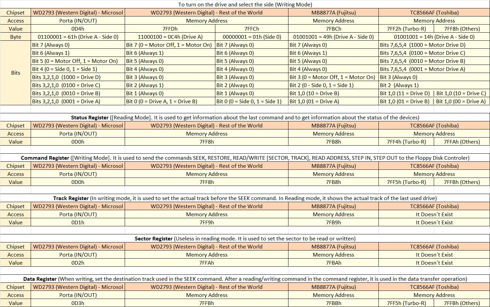

## Gotek Direct Access Mode  
  
  
### Gotek_DAM-0.1.asm  
Example code on how to switch the Gotek in Direct Access Mode, by selecting Track 255 with the floppy controller on the MSX.  
Only for MSX computers with a **S279X** (or compatible) floppy drive controller. (Mostly Philips MSX)

 

### Gotek_Read_ID.asm 
Example tool that reads ID and Firmware version from the Gotek in Direct Access Mode. 

 

 
### Do not use this tool with real floppy drives, the head knocking could misalign the heads of the drive. Use at your own risk !!!. 

 

 
Gotek Direct Access Mode:  

  
FDD Controllers Registers:  
