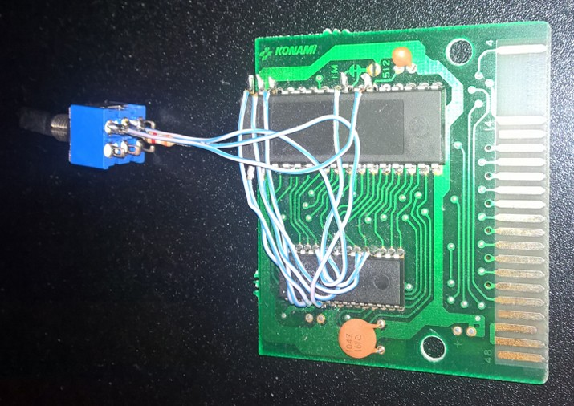

## Konami4 FlashROM
    
### - Info -
I managed to reverse engineer a Konami4 512k FlashROM clone, originally designed by Jipe. (Konami4 aka Konami without SCC)  
The GameROM has been replaced by a flashROM that can be reprogrammed from the MSX,  
the switch disables the FlashROM, allowing it to be reprogrammed.

  

### - Schematics -
I have drawn the following diagram for the correct wiring.  
  
Unfortunately, I can't post the flash software here because i'm not the original owner.