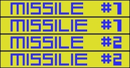

As many times i played this game, i never noticed that Konami game Nemesis 2 (Gradius)  
has misspelled 'MISSILE' as 'MISSILIE' at the bottom of the screen.

To correct this problem, just find the following Hex values in The ROM file (2x)  
E8 EB E8 EB EB 28 1F FF 1F FF FF 1F  
and replace them with these Hex values  
E0 EF E0 EF EF 20 7F FF 7F FF FF 7F

I also created a IPS patch file for Nemesis2 to correct this problem.	 (including Beta & Demo version)

Gradius - Nemesis 2 - Missile Patch <-- Also for Enhanced version  
Gradius - Nemesis 2 Beta Version - Missile Patch.ips  
Gradius - Nemesis 2 Demo Version - Missile Patch.ips   

