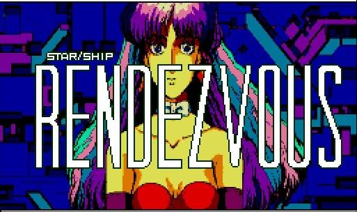

**The Lemon Grass Team Presents: Starchip Rendezvous +6 Trainer IPS Patch v0.10** 
 

* Fixed Intro that said "Starship Rendzvous"  
  
  
* Level Part  
  - Invulnerable  

* Girl Part
  - UNcensored images  
  - No Time limit  
  - 99x of all 'items'  
  - Unlimited stamina  
  - Easy Gameplay  

* Key Combinations  
  - ESC + F2 + F4   Next Level  
  - F1  + F3 + F5    Add Stamina + 'items'  

* General  
  - FM-Pac as default music (MANY THANKS TO FRS !!!)  
  - Game starts In TURBO mode on Turbo-r & WSX  

* How to patch  
  - Find the 1st game disk 'Starship Rendezvous (1988)(Scaptrust)(jp)(Disk 1 of 2).dsk'  
    (SHA1:83de15cd109f3cb3b15ac5e92c2a7e9020fcf23e)  
  - Patch Disk 1 with for example LunarIPS or other IPS tools.  
  - End result should be  
    (SHA1:cc32714376ec8ce3a77d5d7cb9a3af734a8b51ae)  

* If you want to have the UNcensored images on the FRS HDD version of Starship Rendezvous,  
  Just copy the files SMLC0.MPC SMLC1.MPC SMLC2.MPC off a patched disk to your Hard/Flash drive.  

* If you want the fixed intro in the FRS version,  
  just copy OPEN0.P off the patched disk to your Hard/Flash drive.  
  
  

ENJOY
